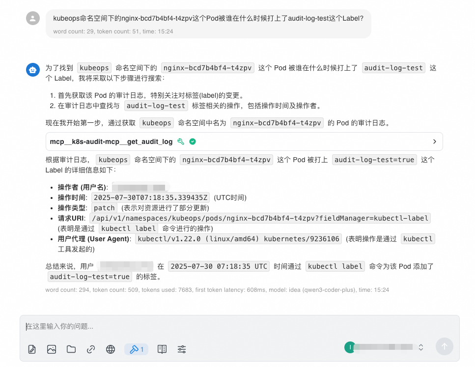

# kube-audit-mcp-server
a simple kubernetes audit log mcp server

## Chat Example


## Quick Start
default use aliyun sls provider, you should set aliyun sls ak/sk/region/project/logstore with env
```
ALIBABA_CLOUD_ACCESS_KEY=<aliyun-sls-ak> \
ALIBABA_CLOUD_ACCESS_SECRET=<aliyun-sls-sk> \
ALIBABA_CLOUD_REGION=<aliyun-sls-region> \
ALIBABA_CLOUD_PROJECT=<aliyun-sls-project> \
ALIBABA_CLOUD_LOG_STORE=<aliyun-sls-logstore> \
go run cmd/mcp-server/main.go 
```


## Flags
```
--mode [sse/stdio] (default: sse)
--host [host] (default: 127.0.0.1)
--port [port] (default: 8080)
--provider [aliyunsls/localfile] (default: aliyunsls)
```
## Provider
### Aliyun SLS Provider
kube-audit-mcp-server can use aliyun sls to read and filter audit logs.
if we store audit logs in aliyun sls, we can use aliyun sls provider to read and filter audit logs.
#### Usage
default use aliyun sls provider, you should set aliyun sls ak/sk/region/project/logstore with env
```
ALIBABA_CLOUD_ACCESS_KEY=<aliyun-sls-ak> \
ALIBABA_CLOUD_ACCESS_SECRET=<aliyun-sls-sk> \
ALIBABA_CLOUD_REGION=<aliyun-sls-region> \
ALIBABA_CLOUD_PROJECT=<aliyun-sls-project> \
ALIBABA_CLOUD_LOG_STORE=<aliyun-sls-logstore> \
go run cmd/mcp-server/main.go 
```
#### Support Query
- resource: k8s resource
- namespace: k8s namespace
- name: k8s resource name
- timeFrom: query start time
- timeTo: query end time


### Local File Provider
kube-audit-mcp-server can use local file to read and filter audit logs.
if we store audit logs in local file, we can use local file provider to read and filter audit logs.
#### Usage
use local file provider, you should set local file path with env
```
LOCAL_FILE_PATH=<local-file-path> \
go run cmd/mcp-server/main.go 
```
#### Support Query
- resource: k8s resource
- namespace: k8s namespace
- name: k8s resource name
- lastN: query last n lines

